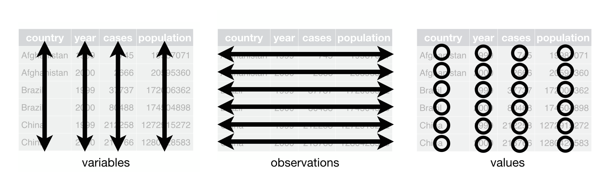
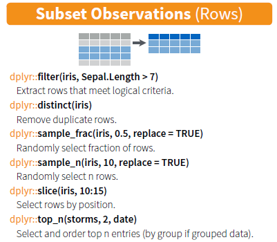
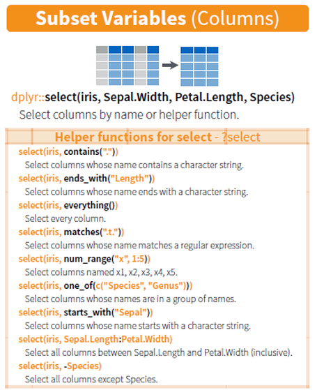

presentation
========================================================
author: 
date: 
autosize: false
css: presstyle.css


Principles of tidy data
========================================================
<hr>

<small><i>(Wickham & Grolemund)</i></small>

Tidy datasets
========================================================

<small>
Untidy 
<table>
  <tr>
    <th><br>id</th>
    <th>var</th>
    <th>val_jan</th>
    <th>val_aug<br></th>
  </tr>
  <tr>
    <td>1</td>
    <td>City</td>
    <td>Mannheim</td>
    <td>Mannheim</td>
  </tr>
  <tr>
    <td>1</td>
    <td>temperature</td>
    <td>5C / 41F<br></td>
    <td>30C / 86F</td>
  </tr>
  <tr>
    <td>2</td>
    <td>City</td>
    <td>Hamburg</td>
    <td>Hamburg</td>
  </tr>
  <tr>
    <td>2</td>
    <td>temperature</td>
    <td>-5C / 23F</td>
    <td>25C / 77F</td>
  </tr>
</table>

- Same observation in diff. lines
- No unique measurement in cols
- Strings and numeric in same col
- 2 values in one cell

</table>
</small>

***

-


Tidy datasets
========================================================

<small>
Untidy 
<table>
  <tr>
    <th><br>id</th>
    <th>var</th>
    <th>val_jan</th>
    <th>val_aug<br></th>
  </tr>
  <tr>
    <td>1</td>
    <td>City</td>
    <td>Mannheim</td>
    <td>Mannheim</td>
  </tr>
  <tr>
    <td>1</td>
    <td>temperature</td>
    <td>5C / 41F<br></td>
    <td>30C / 86F</td>
  </tr>
  <tr>
    <td>2</td>
    <td>City</td>
    <td>Hamburg</td>
    <td>Hamburg</td>
  </tr>
  <tr>
    <td>2</td>
    <td>temperature</td>
    <td>-5C / 23F</td>
    <td>25C / 77F</td>
  </tr>
</table>

- Same observation in diff. lines
- No unique measurement in cols
- Strings and numeric in same col
- 2 values in one cell

***

Tidy
<table>
  <tr>
    <th><br>id</th>
    <th>City</th>
    <th>month</th>
    <th><br>temp_C</th>
    <th>temp_F</th>
  </tr>
  <tr>
    <td>1</td>
    <td>Mannheim</td>
    <td>jan</td>
    <td>5</td>
    <td>41</td>
  </tr>
  <tr>
    <td>2</td>
    <td>Mannheim</td>
    <td>aug</td>
    <td>25</td>
    <td>77</td>
  </tr>
  <tr>
    <td>3</td>
    <td>Hamburg</td>
    <td>jan</td>
    <td>-5</td>
    <td>23</td>
  </tr>
  <tr>
    <td>4</td>
    <td>Hamburg</td>
    <td>aug</td>
    <td>25</td>
    <td>77</td>
  </tr>
</table>

- Every line is one case
- Every column is one variable
- Can summarise columns
- Cells are values
</small>


Load data 
========================================================
class: at75
<hr>

- <i>readr</i> reads file as tibbles
- tibbles = enhanced data frames
  - more classes for columns
  - look nicer when printed


```r
library(readr)
read_csv(filename)
read_tsv(filename)
read_delim(filename, 
           sep = "char")
```
---

Two datasets:
- <b>EMPL</b>: Employment rate of the age group 15-64 by NUTS 2 regions [tgs00007] <br> (% employed in each region) <br> <i>file: empl_rates_reg.tsv</i>
- <b>TRAIN</b>: Adult participation in learning by sex [sdg_04_60]<br> (% of population aged 25 to 64) <br> <i>file: traing_participation.csv</i>
- https://ec.europa.eu/eurostat/data/database

Pipe operator
========================================================


```
[1] 5
```

SUBSETTING ROWS / FILTER
========================================================
<hr>



SUBSETTING COLUMNS / SELECT
========================================================
<hr>
<large>

</large>

SLIDE
========================================================
<hr>


SLIDE
========================================================
<hr>
